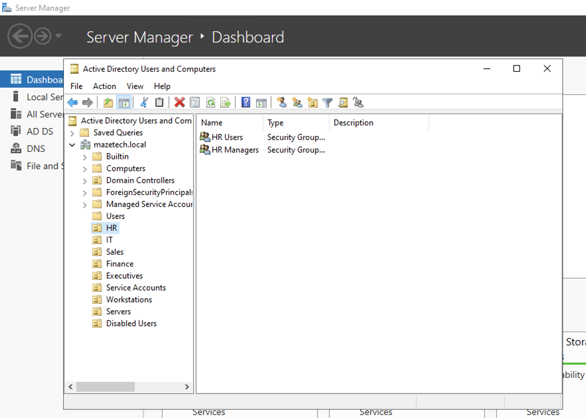
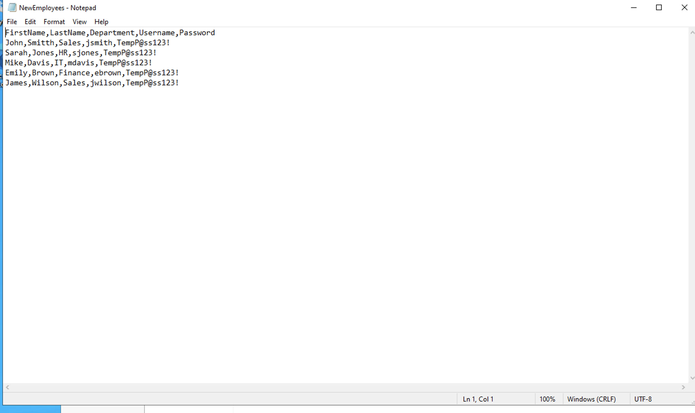
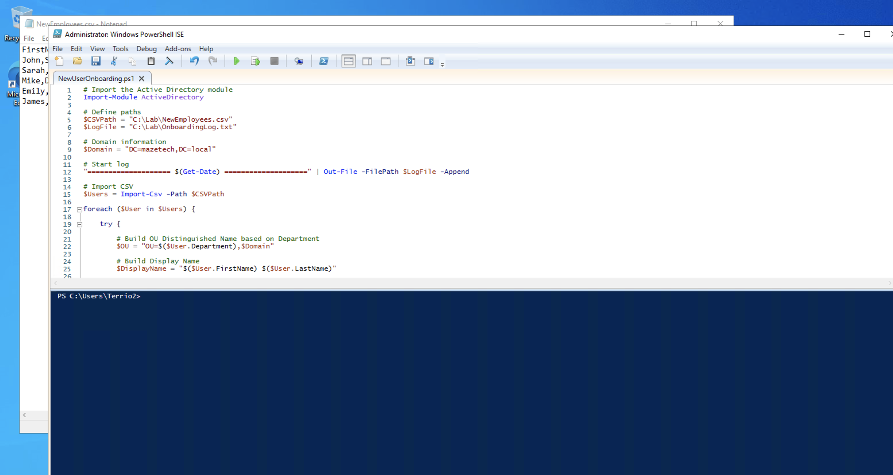
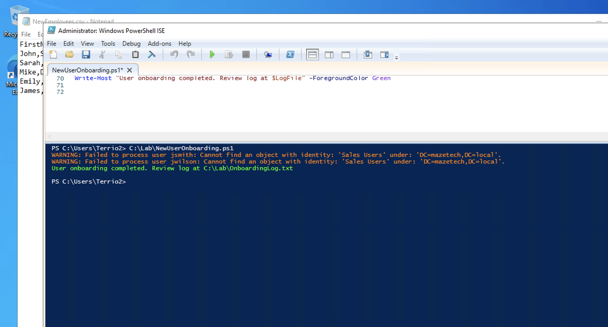
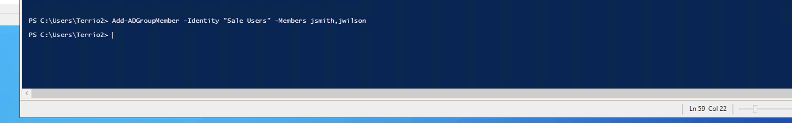
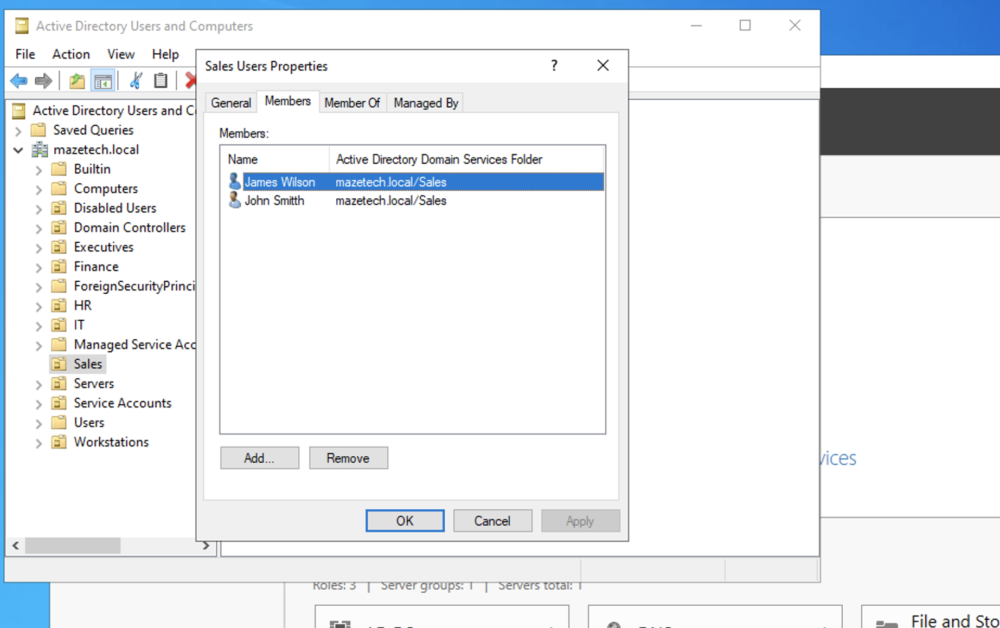

# Active Directory User Onboarding Automation

## Overview

This project demonstrates how I automated the Active Directory user onboarding process using PowerShell.

Instead of manually creating user accounts, assigning Organizational Units (OUs), adding security group memberships, and documenting each action, I developed a PowerShell automation that performs the entire onboarding workflow from a CSV file.

During development, I also encountered a real troubleshooting scenario involving a security group naming mismatch. I investigated the issue, identified the root cause, corrected it, and verified the solution before completing the deployment.

This project demonstrates practical Identity & Access Management (IAM) administration, Active Directory automation, troubleshooting, and technical documentation.

---

# Business Scenario

A growing company hired multiple employees across different departments.

The IT department needed an automated solution that could:

- Create Active Directory user accounts
- Place users into the correct Organizational Units
- Assign department security groups
- Require password changes at first logon
- Log successful and failed operations
- Reduce manual onboarding time
- Provide repeatable and consistent account provisioning

To accomplish this, I built a PowerShell onboarding automation script.

---

# Environment

- Windows Server
- Active Directory Domain Services (AD DS)
- Active Directory Users and Computers (ADUC)
- PowerShell
- ActiveDirectory PowerShell Module
- CSV Data Import

---

# Technologies & Skills Demonstrated

- Active Directory Administration
- PowerShell Automation
- Identity Lifecycle Management
- User Provisioning
- Organizational Unit (OU) Management
- Security Group Administration
- Group-Based Access Control
- Bulk User Creation
- CSV Data Processing
- Error Handling (Try/Catch)
- PowerShell Logging
- Troubleshooting
- Technical Documentation

---

# Project Workflow

## Step 1 — Build Active Directory Structure

I created a department-based Active Directory structure using Organizational Units (OUs) to organize company resources.

Departments included:

- Sales
- HR
- IT
- Finance
- Executives
- Service Accounts
- Servers
- Workstations
- Disabled Users

I also created department security groups that would later be assigned automatically by the onboarding script.



---

## Step 2 — Create Employee Import File

To simulate a real onboarding request from Human Resources, I created a CSV file containing new employee information.

The CSV included:

- First Name
- Last Name
- Department
- Username
- Temporary Password

The onboarding script imports this file and provisions every employee automatically.



---

## Step 3 — Develop PowerShell Onboarding Script

I developed a PowerShell script that automates the complete onboarding process.

The script performs the following actions:

- Imports employee records from the CSV file
- Creates Active Directory user accounts
- Builds the correct Organizational Unit path based on department
- Assigns usernames and User Principal Names (UPNs)
- Configures secure temporary passwords
- Requires password changes at first logon
- Enables each account
- Assigns users to department security groups
- Logs successful and failed operations
- Uses Try/Catch error handling for troubleshooting

This automation significantly reduces manual administrative effort while improving consistency.



---

## Step 4 — Initial Script Execution

During the initial execution, the script successfully created user accounts for every employee.

However, two Sales users were not added to their department security group.

The script returned an error indicating that it could not locate the specified Active Directory group.

Rather than modifying working portions of the script, I investigated the underlying cause before making changes.



---

## Step 5 — Troubleshooting & Resolution

I reviewed the script and compared it with the Active Directory configuration.

During troubleshooting, I discovered the issue was not with the user creation logic.

Instead, I found a spelling mismatch between the security group referenced in the script and the actual Active Directory group.

Because of the naming mismatch, Active Directory could not resolve the requested group.

After identifying the incorrect group name, I corrected the reference and reran the group assignment.

I then manually verified the fix using PowerShell to confirm the Sales users were successfully added to the proper security group.

This experience reinforced the importance of validating naming conventions before assuming automation logic has failed.



---

## Step 6 — Verify User Creation

After correcting the issue, I verified the onboarding results using PowerShell.

I executed:

```powershell
Get-ADUser -Filter * | Select Name,SamAccountName
```

The output confirmed that all employee accounts had been successfully created.

Verification confirmed:

- John Smith
- Sarah Jones
- Mike Davis
- Emily Brown
- James Wilson


---

## Step 7 — Verify Security Group Membership

Finally, I validated that the Sales department users were members of the correct Active Directory security group.

Opening the group properties confirmed both Sales employees had been successfully added after correcting the naming mismatch.

This completed the onboarding workflow and verified that user provisioning and authorization were functioning correctly.



---

# Results

Successfully automated the onboarding process by:

- Creating multiple Active Directory user accounts
- Automatically placing users into department Organizational Units
- Assigning department security groups
- Requiring password changes at first logon
- Logging all successful and failed operations
- Troubleshooting and correcting a security group naming mismatch
- Verifying successful account creation with PowerShell
- Validating security group membership within Active Directory

---

# Lessons Learned

This project strengthened my understanding of Identity & Access Management by demonstrating that automation is only as reliable as the underlying Active Directory configuration.

Key takeaways included:

- Validate Active Directory objects before assuming automation has failed.
- Consistent naming conventions are critical for successful identity automation.
- Logging and error handling simplify troubleshooting.
- Separating identity creation from authorization verification improves validation.
- Testing and documenting issues are just as important as writing the automation itself.

---

# Future Improvements

Future enhancements for this project include:

- Automatic password generation
- Email notification after onboarding
- Duplicate account detection
- Manager assignment
- Home folder creation
- Department-specific group mapping from configuration files
- Additional logging and reporting
- Azure AD / Microsoft Entra ID integration

---

# Author

**Monterrio Maze**

GitHub: https://github.com/MonterrioM

LinkedIn: https://www.linkedin.com/in/monterrio

---

**Project Focus:** Identity & Access Management (IAM) • Active Directory • PowerShell Automation • User Provisioning • Identity Lifecycle Management
